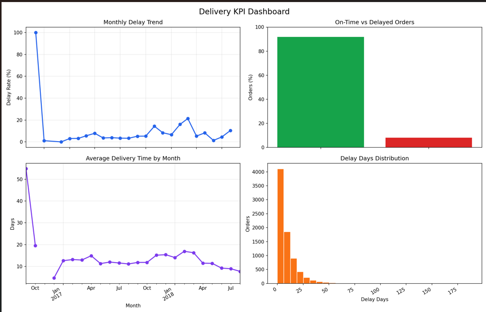

# 🚚 Logistics KPI Optimization & Operations Analysis

## 📌 Overview
This project focuses on analyzing logistics operations using real-world e-commerce delivery data to identify inefficiencies in delivery performance and optimize key operational metrics.

The goal is to simulate how data-driven decision making can improve logistics systems, similar to modern freight-tech companies.

## 📄 Analysis Report  
Detailed findings and recommendations: [View Report](reports/final_analysis.md)
## 📊 Dashboard Preview

---

## 🎯 Objectives
- Track and analyze logistics KPIs
- Identify delivery inefficiencies
- Understand delay patterns
- Propose data-driven operational improvements

---

## 📊 Key KPIs
- Average Delivery Time
- Delay Rate (%)
- On-Time Delivery Rate (%)

---

## 🛠️ Tools & Technologies
- Python (Pandas, Matplotlib)
- Power BI (Dashboarding)
- SQL (optional extension)

---

## 📈 Dashboard Preview

---

## 🔍 Key Insights

- Delay rates fluctuate significantly over time, indicating operational bottlenecks during peak periods  
- Delivery time variability suggests inefficiencies in routing and scheduling  
- Short-distance deliveries also experience delays, highlighting systemic inefficiencies  
- Performance trends indicate the need for demand-aware logistics planning  

---

## 🚀 Recommendations

- Implement traffic-aware and demand-aware routing optimization  
- Improve delivery scheduling and load balancing  
- Monitor KPIs in real-time for proactive decision-making  
- Use predictive planning to prepare for high-demand periods  

---

## ⚙️ Project Structure

- `data/` → Raw dataset  
- `src/` → Data processing and KPI logic  
- `notebooks/` → Exploratory analysis  
- `powerbi/` → Interactive dashboard  
- `images/` → Visual outputs  

---

## 🧠 Business Impact

This project demonstrates how logistics operations can be improved using data analytics by:
- Reducing delays  
- Improving delivery efficiency  
- Enabling proactive decision-making  

---

## 📌 Future Improvements

- Integrate real-time traffic APIs  
- Build predictive ML model for delay forecasting  
- Add route optimization algorithms  

---

## 🙌 Author
Sneha Tyagi
