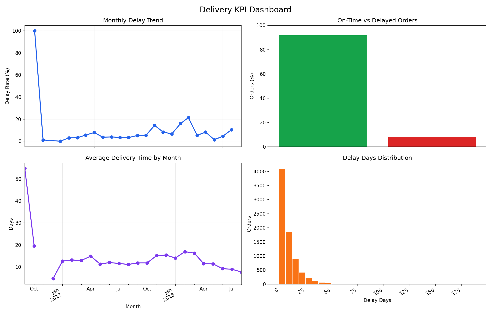

# Logistics KPI Optimization and Route Efficiency

This project analyzes e-commerce delivery performance using Olist-style order data. It computes logistics KPIs, identifies delay patterns, and generates dashboard charts for delivery operations.

## Objectives

- Track average delivery time, delay rate, and on-time delivery rate
- Analyze monthly delivery delay trends
- Visualize delivery performance with Matplotlib dashboards
- Support operational recommendations for route efficiency and scheduling

## Run

Install dependencies:

```powershell
pip install -r requirements.txt
```

Run with the full dataset:

```powershell
python src\main.py
```

Run without opening the chart window and save the dashboard:

```powershell
python src\main.py --save-plot reports\dashboard.png --no-show
```

Run with the bundled sample data:

```powershell
python src\main.py --data data\sample_orders.csv --save-plot reports\dashboard.png --no-show
```

## Required Columns

The orders CSV must include:

- `order_id`
- `order_purchase_timestamp`
- `order_delivered_customer_date`
- `order_estimated_delivery_date`

## Outputs

The app prints:

- Total orders
- Average delivery time in days
- Average delay days
- Delay rate percentage
- On-time rate percentage

It also shows or saves a dashboard with:

- Monthly delay trend
- On-time vs delayed orders
- Average delivery time by month
- Delay days distribution

## Analysis Report

Detailed findings and recommendations are available in [reports/final_analysis.md](reports/final_analysis.md).

## Dashboard Preview



## Tools

- Python
- Pandas
- Matplotlib

## Author

Sneha Tyagi
